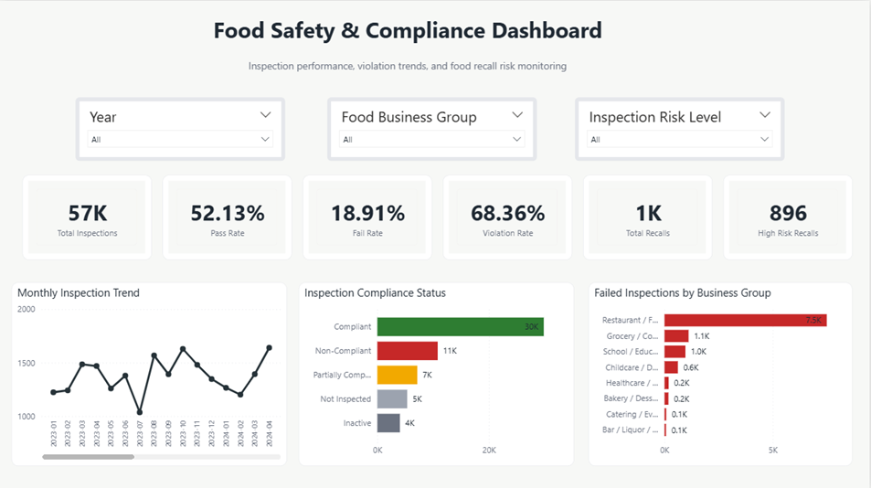
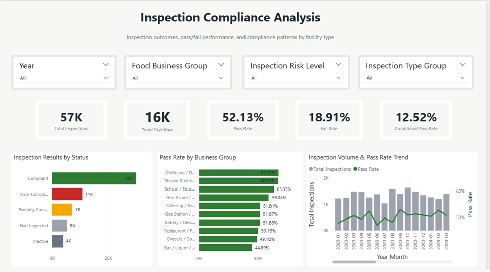
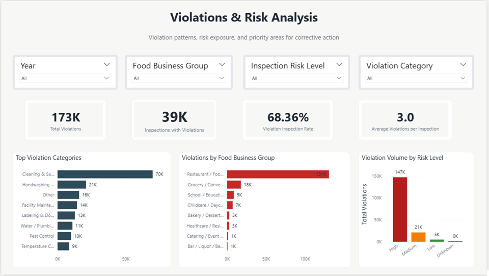
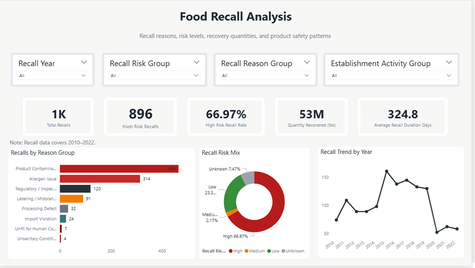
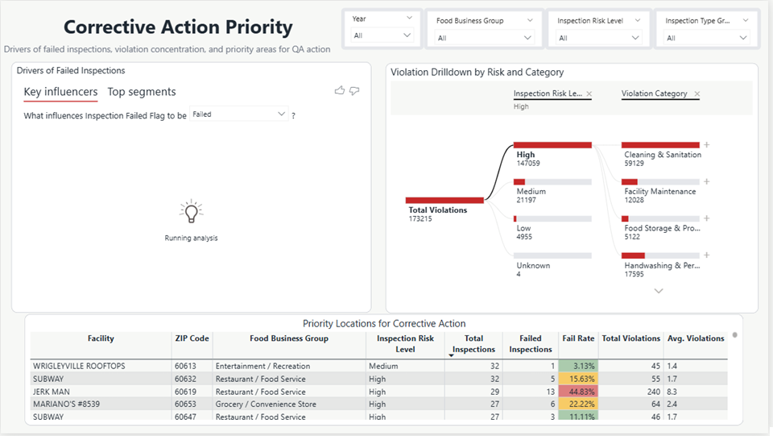
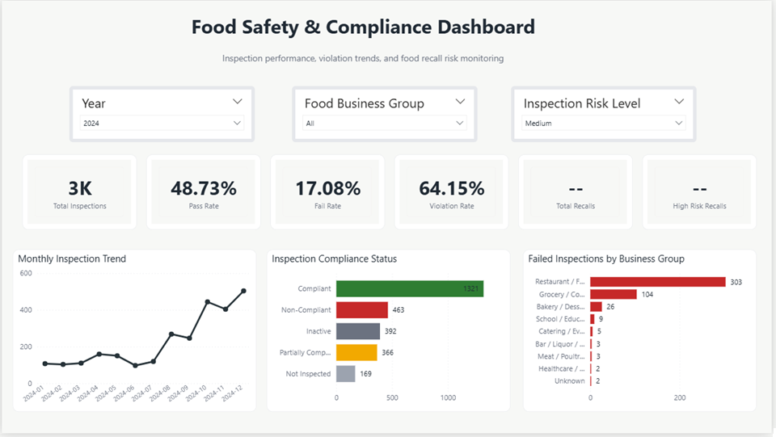

# Food Safety & Compliance Dashboard — Power BI

A Power BI dashboard project analyzing food inspection outcomes, violation patterns, food recall risks, and corrective-action priorities using public food safety datasets.

This project was created as part of my transition into data analysis, combining Power BI dashboarding skills with my background in food safety, quality assurance, audits, and compliance.

---

## Project Objective

The objective of this project is to explore food safety and compliance data in a practical dashboard format and answer questions such as:

* How many inspections were conducted?
* What are the pass, fail, and conditional pass rates?
* Which food business groups show higher inspection failure rates?
* How are violations distributed across inspection risk levels?
* What are the main recall risk patterns?
* Which facilities may need closer compliance review?

---

## Dashboard Pages

The Power BI report includes five main pages:

1. **Executive Overview**
   A high-level summary of inspections, pass/fail performance, violations, and recall indicators.

2. **Inspection Compliance Analysis**
   A closer look at inspection outcomes, compliance results, inspection trends, and facility performance.

3. **Violations & Risk Analysis**
   Analysis of violations by risk level, facility type, and inspection result.

4. **Food Recall Analysis**
   Overview of food recall cases, recall risk groups, quantity recovered, and recall duration.

5. **Corrective Action Priority**
   A simple priority view to help identify facilities that may need closer follow-up based on inspection and violation patterns.

---

## Dataset

This project uses public food safety datasets related to:

* Food inspections
* Inspection results
* Facility types
* Violation records
* Food recalls

The data was cleaned and prepared for dashboard analysis. Some fields were grouped or simplified to make the dashboard easier to read and understand.

---

## Key Measures Created

Some of the main DAX measures used in the dashboard include:

* Total Inspections
* Total Facilities
* Passed Inspections
* Failed Inspections
* Conditional Pass Inspections
* Pass Rate
* Fail Rate
* Violation Inspection Rate
* Average Violations per Inspection
* Total Recalls
* High Risk Recall Rate
* Quantity Recovered
* Average Recall Duration Days

---

## Tools Used

* Power BI
* Power Query
* DAX
* Data Modeling
* Data Visualization

---

## Dashboard Screenshots

### Executive Overview

### Inspection Compliance Analysis

### Violations & Risk Analysis

### Food Recall Analysis

### Corrective Action Priority

### Filtered Dashboard Example

---

## Project Files

* `README.md` — project overview and documentation
* `Screenshots/` — dashboard screenshots
* `food-safety-compliance-dashboard-case-study.pdf` — dashboard case study PDF
* Power BI file may be added separately if file size allows

---

## Project Note

This project is for portfolio and educational purposes. The dashboard is not intended to replace official food safety reporting systems or regulatory decision-making tools.

The purpose of the project is to demonstrate beginner-to-junior level skills in data cleaning, data modeling, dashboard design, DAX measures, and practical business analysis using Power BI.

---

## Key Skills Demonstrated

* Preparing and transforming data in Power Query
* Building a basic Power BI data model
* Creating DAX measures for KPIs and rates
* Designing multi-page dashboards
* Using slicers and filters for interactive analysis
* Applying food safety and QA domain knowledge to data analysis
* Presenting compliance-related insights in a clear visual format
